  

<h1 align="center">Hi 👋, I'm Divy Kairoth</h1>

<h3 align="center">
  A Builder & Creator crafting web apps, tools, and open-source projects
</h3>

<h4 align="center">
  I build with <b>JavaScript, TypeScript, React,</b> and the modern web stack. 
  Passionate about creating tools that solve real problems and sharing knowledge along the way.
</h4>

<h4 align="center">
  💡 Open to <b>collaboration, partnerships,</b> and <b>interesting projects</b>. 
  🌐 <a href="https://github.com/kairothq">github.com/kairothq</a>
</h4>

---

<h3 align="center">🛠️ Tech Stack</h3>

  
  
  
  
  
  

---

<h3 align="center">📊 GitHub Stats</h3>

  

  

